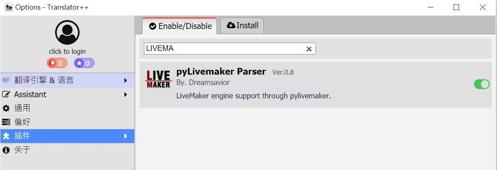
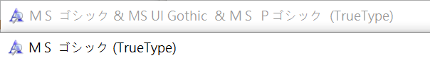

>  近期連續接觸了挺多Livemaker遊戲，趁著記憶還新鮮，趕緊紀錄一下  
>  基本上參考了[漢化黑礁2、3的](https://github.com/CyanidEEEEE/Livemaker-chinese-tl)大佬以及[M系鏡像](https://mirror.chromaso.net/thread/55682)的帖子  
>  所以基礎的其實看上面大佬說的，我就記錄一下遇到的痛點
## 安裝pylivemaker
```
pip install pylivemaker
```
安裝後你可以去它的[文檔](https://pylivemaker.readthedocs.io/en/latest/usage.html)看，有非常細緻的解釋一些常規操作

## 解包Livemaker
### GARbro
GARbro使用上非常簡單，你只需要把你把你資料夾底下最大的遊戲檔(ex:game.dat 或 game.exe)丟進去，就能看到一堆0000xxxlsb和是日文的...作成lsb

### Translator++
一個能複合式拆包並能集成翻譯用途的軟件，但是要導入Livemaker的遊戲文件要另外下載T++的插件，點[選項-插件]就能下載了，然後再把你的exe or dat檔匯入加載，它會自動幫你分類解包好!

裡面會生成兩種資料夾，一個是text(你的文本)、一個是menu(你的選項)，可以說相當直觀而且輪椅


## 導出csv來翻譯
這部分你可以直接使用pylivemaker命令行導出日文，在Translated texts的欄位底下打上翻譯
```
lmlsb extractcsv --encoding=utf-8-sig 000000XX.lsb 000000XX.csv
```
或是用T++的內部生成表格來翻譯

**但要特別說明，如果你是用T++內部的表格作基底翻譯，它的Text 底下的表格跟你用pylivemaker匯出的csv不同行數是正常的，因為T++會省略一些重複性高的文本，但到時候你把整個專案匯出之後，你會發現表格的行數又pylivemaker生成的一樣了**

## 記得翻譯菜單

### 遊戲菜單
遊戲菜單基本就在\ノベルシステム\■初期化.lsb
去那個資料夾底下把它用xml打開

```
lmlsb dump --encoding=utf-8 ■初期化.lsb --mode xml --output-file ■初期化.xml
```

看StringToArray在哪裡，基本在LineNo=66跟LineNo=67，而你只要更改66行

```
lmlsb edit  ■初期化.lsb 66 
```

基本上改成下面這樣就行了，我不知道改成簡體能不能運行，總之用繁體比較保險

```
<Item Command="Calc" LineNo="66" Indent="0" Mute="0" NotUpdate="1" Color="0">
      <Calc>StringToArray("隱藏文字,劇情回顧,跳過已讀文本,自動文本推進,保存,讀取,選項,自動跳過已讀文本,文本速度...,自動文本推進時間設定...,字體選擇...,播放聲音,音量調節...,背景音樂,音效,台詞,MIDI輸出端口選擇...,全屏,顯示模式...,結束遊戲,返回標題畫面,退出", システムメニュー項目名, ",")</Calc>
```
### 遊戲選項

遊戲選單真的不能用簡體字，直說吧，選項只能用日本字體的漢字跟繁體。
我這裡去這兩個網站[字嗨](https://zi-hi.com/sp/jfont/) [JCinfo](https://www.jcinfo.net/zh-hant/tools/kanji)找找看有沒有啥近義的字做為替代，幸好只要找一些就好了，然後用下面命令行導出跟導回去編輯後的目錄，跟extractcsv一樣

```
lmlsb extractmenu --encoding=utf-8-sig 000000XX.lsb 000000XX.csv
lmlsb insertmenu --encoding=utf-8-sig 000000XX.lsb 000000XX.csv
```

| 簡/繁 | 日文漢字替代 |
| --- | :----: |
| 你   |   祢    |
| 啊   |   阿    |

## 替換字典
因為Livemaker一定要用日文系統跟系統預設的日文字體(msgothic)，所以造成非常多崩潰的現象
感謝諸位大佬發明出了更替字型的方法，方便我們後人。
[M系鏡像搞出來的字體工具](https://github.com/shy2052/fontObfuscator)，但還不懂如何實操。
這部分我踩的坑實在太太太多了，於是要特別說明：
**如果你對字型完全不熟悉，那就別動任何字體！直接使用別人給的字體和字典來替換就夠了！別自作聰明！
字體部分，我最後用了別人提供的【MS-Gothic.ttf】字體
字典使用GalTransl_DumpInjector的
但中間遇到非常多問題：**

- 黑礁大佬也給了他的字體檔【msgothic.otf】，但我用的兩個Livemaker遊戲都不能識別出來
- 後來改用M系鏡像大佬給的【SarasaUiSC-Regular.ttf】是可以正常識別的，故得出我這兩個遊戲**只能識別ttf檔案**的結論
- 但SarasaUiSC-Regular的字體在遊戲裡預設太小了，使用FontForge臨時想改大小會破壞部份字體形狀，只能再想別的辦法
- 終於找到有ttf的替換過ＭＳ ゴシック檔，但批量更改文本字典後，遊戲內部文件仍然不能正常顯示！
- 這時我基本有點半崩潰了，後來去看了下我的字體，然後去遊戲內更改字體的選項內後發現其實原因很簡單
- 系統預設的ＭＳ ゴシック.ttf(英文就是msgothic)跟我安裝的MS-Gothic.ttf會被遊戲辨認成兩種不一樣的東西，所以雖然我安裝的字體明明也叫做ＭＳ ゴシック，但跟個小三似的不被承認，還要另外去遊戲選單改成msgothic名字的我的字體，這樣才能辨識成功


## 處理圖片
跟黑礁漢化大佬說的一樣，用GraphicsGale打開GAL圖檔，然後有些道具背景是透明的記得在裡面要開ALPHA通道(Image-Add Alpha Chanel)，導出PNG時也要記得打開ALPHA的勾勾選項。

## 封包回去...但其實也不用封

因為我有一個Livemaker遊戲的遊戲內容是封在exe裡面的，所以可以把我要封的內容(グラフィック裡面的全部檔案)直接用命令行封回exe，這個指令非常智能，能直接替換グラフィック資料夾下給所有的檔案

```
lmpatch -r GAME.exe グラフィック
```

不過如果你的檔案都在dat裡面，我還不知道怎麼封，但也不需要特別擔心

直接丟在外面，Livemaker會優先讀取外面的檔當作補丁了，算是這遊戲系統最智能的地方。
